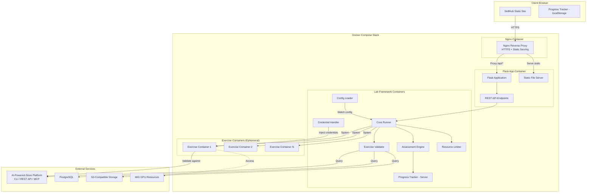
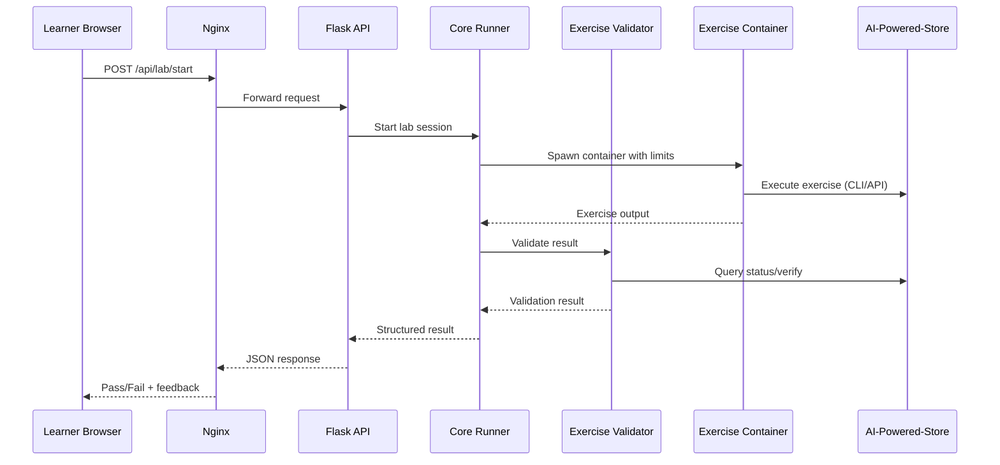
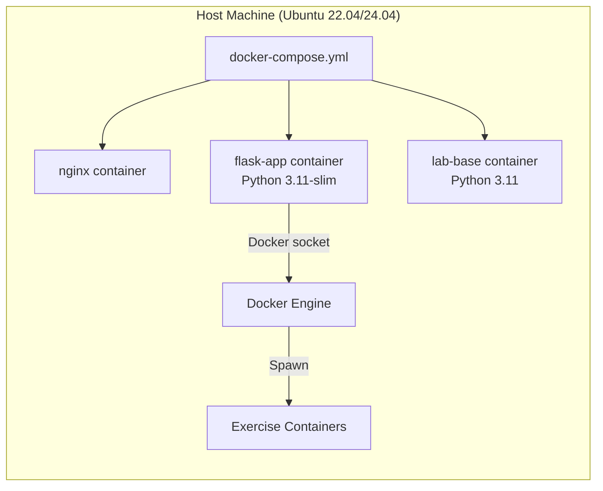

# Design Document: AI Store Labs

## Overview

The AI Store Labs project is an interactive training platform for the OPCP AI-Powered-Store. It consists of two main subsystems:

1. **SkillHub** — A static HTML training website with bilingual support (EN/FR), lesson navigation, progress tracking, and code highlighting.
2. **Lab Framework** — A Python-based engine that orchestrates, validates, and tracks hands-on lab exercises within Docker containers.

The platform is served by a Flask application, orchestrated with Docker Compose (Flask + Nginx), and follows the architectural patterns established by the reference project `opcp-openstack-first-steps`.

### Design Goals

- Mirror the reference project structure for consistency across OPCP training platforms
- Provide complete isolation between learner exercise environments
- Support offline-first SkillHub operation with localStorage persistence
- Enable content authors to create lab modules with minimal framework knowledge
- Hot-reload YAML configuration without service restarts

---

## Architecture

### High-Level System Diagram



### Component Communication



### Deployment Architecture



---

## Components and Interfaces

### 1. SkillHub Frontend

| Module | File | Responsibility |
|--------|------|---------------|
| Main | `skillhub/js/main.js` | Application bootstrap, module initialization |
| Lessons | `skillhub/js/lessons.js` | Lesson_Catalog data, lesson rendering |
| Navigation | `skillhub/js/navigation.js` | Sidebar, hamburger menu, routing |
| I18n | `skillhub/js/i18n.js` | Locale detection, switching, URL routing |
| Progress | `skillhub/js/progress.js` | localStorage progress persistence |
| Code Highlight | `skillhub/js/code-highlight.js` | Syntax highlighting for code blocks |

#### Module Interfaces

```javascript
// lessons.js - Lesson_Catalog
export const lessons = [
  {
    id: "install-bare-metal",
    slug: "install-bare-metal",
    title: { en: "Installation on Bare-Metal Ubuntu", fr: "Installation sur Ubuntu Bare-Metal" },
    difficulty: "beginner", // "beginner" | "intermediate" | "advanced"
    estimatedMinutes: 60,   // 1-480
    prerequisites: []       // array of lesson ids
  },
  // ...
];

export function getLessonBySlug(slug) { /* ... */ }
export function getLessonsByDifficulty(difficulty) { /* ... */ }
export function getPrerequisiteChain(lessonId) { /* ... */ }
```

```javascript
// navigation.js
export function initNavigation(lessonsData, progressData) { /* ... */ }
export function renderSidebar(container, lessons, progress) { /* ... */ }
export function initHamburgerMenu() { /* ... */ }
export function navigateToLesson(slug, locale) { /* ... */ }
```

```javascript
// i18n.js
export function detectLocale() { /* returns "en" | "fr" */ }
export function switchLocale(locale) { /* ... */ }
export function getStoredLocalePreference() { /* ... */ }
export function setLocalePreference(locale) { /* ... */ }
```

```javascript
// progress.js
export function markLessonComplete(lessonId) { /* ... */ }
export function isLessonComplete(lessonId) { /* returns boolean */ }
export function getCompletionPercentage(totalLessons) { /* returns integer 0-100 */ }
export function getCompletedLessons() { /* returns array of lessonIds */ }
export function resetProgress() { /* ... */ }
```

### 2. Flask Application

```python
# app.py - Flask Application Entry Point
from flask import Flask, jsonify, send_from_directory
from src.api import lab_routes

app = Flask(__name__, static_folder='skillhub')

# Static serving
@app.route('/')
@app.route('/<path:path>')
def serve_skillhub(path='index.html'): ...

# Health check
@app.route('/health')
def health(): 
    return jsonify({"status": "healthy"}), 200

# API blueprint
app.register_blueprint(lab_routes, url_prefix='/api')
```

```python
# src/api/routes.py - Lab API Endpoints
from flask import Blueprint

lab_routes = Blueprint('lab', __name__)

@lab_routes.route('/lab/start', methods=['POST'])
def start_lab_session(module_id: str, student_id: str) -> dict:
    """Start a new lab session. Returns session_id and container info."""
    ...

@lab_routes.route('/lab/status/<session_id>', methods=['GET'])
def get_session_status(session_id: str) -> dict:
    """Check lab session status. Returns state, progress, elapsed time."""
    ...

@lab_routes.route('/lab/result/<session_id>/<exercise_id>', methods=['GET'])
def get_exercise_result(session_id: str, exercise_id: str) -> dict:
    """Retrieve exercise validation result."""
    ...

@lab_routes.route('/lab/submit', methods=['POST'])
def submit_exercise(session_id: str, exercise_id: str, submission: dict) -> dict:
    """Submit an exercise for validation."""
    ...
```

### 3. Lab Framework Core

```python
# labs/core/runner.py
class LabRunner:
    """Orchestrates exercise execution within Docker containers."""
    
    def __init__(self, config: LabConfig, credential_handler: CredentialHandler): ...
    
    def start_session(self, module_id: str, student_id: str) -> SessionResult:
        """Spawn a container and initialize a lab session."""
        ...
    
    def execute_exercise(self, session_id: str, exercise_id: str, submission: dict) -> ExerciseResult:
        """Run an exercise within the session container."""
        ...
    
    def terminate_session(self, session_id: str) -> None:
        """Stop and remove the session container."""
        ...
```

```python
# labs/core/config_loader.py
class ConfigLoader:
    """Loads and validates Lab_Config YAML files with hot-reload support."""
    
    def __init__(self, config_path: str): ...
    
    def load(self) -> LabConfig:
        """Parse and validate YAML configuration."""
        ...
    
    def validate(self, raw_config: dict) -> tuple[bool, list[str]]:
        """Validate config structure, ranges, DAG integrity. Returns (valid, errors)."""
        ...
    
    def watch(self, callback: Callable[[LabConfig], None]) -> None:
        """Watch config file for changes, invoke callback on valid updates."""
        ...
```

```python
# labs/core/assessment.py
class AssessmentEngine:
    """Evaluates exercise submissions against expected outcomes."""
    
    def evaluate(self, exercise_id: str, submission: dict, expected: dict) -> AssessmentResult:
        """Run all checks for an exercise. Returns pass/fail with per-check details."""
        ...

class AssessmentResult:
    status: str  # "pass" | "fail"
    checks: list[CheckResult]
    feedback: str
```

```python
# labs/core/progress.py
class ProgressTracker:
    """Persists exercise completion state server-side."""
    
    def __init__(self, storage_path: str): ...
    
    def record_completion(self, student_id: str, module_name: str, 
                          exercise_id: str, result: str) -> None:
        """Record an exercise attempt with timestamp."""
        ...
    
    def get_progress(self, student_id: str, module_name: str = None) -> list[ProgressEntry]:
        """Retrieve progress records, optionally filtered by module."""
        ...
    
    def is_module_complete(self, student_id: str, module_name: str) -> bool:
        """Check if all exercises in a module are passed."""
        ...
```

```python
# labs/core/resource_limiter.py
class ResourceLimiter:
    """Enforces CPU, memory, and time constraints on containers."""
    
    def __init__(self, config: LabConfig): ...
    
    def get_container_limits(self, module_id: str) -> ResourceLimits:
        """Get limits for a specific module from config."""
        ...
    
    def apply_limits(self, container_id: str, limits: ResourceLimits) -> None:
        """Apply resource constraints to a Docker container."""
        ...
    
    def monitor(self, container_id: str, limits: ResourceLimits, 
                on_exceed: Callable[[str], None]) -> None:
        """Monitor container and invoke callback if limits exceeded."""
        ...
```

```python
# labs/core/validators.py
class ExerciseValidator:
    """Validates individual exercise steps against JSON assertions."""
    
    def __init__(self, platform_client: PlatformClient): ...
    
    def validate_step(self, step: dict, assertion: dict) -> ValidationResult:
        """Check a single step against its expected outcome."""
        ...
    
    def validate_exercise(self, exercise_id: str, steps: list[dict]) -> ExerciseResult:
        """Validate all steps in an exercise sequentially."""
        ...
```

```python
# labs/core/credential_handler.py
class CredentialHandler:
    """Manages API keys and tokens from environment or secrets file."""
    
    def __init__(self, secrets_file: str = None): ...
    
    def get_credential(self, key: str) -> str:
        """Retrieve a credential by key. Raises if not found."""
        ...
    
    def inject_into_env(self, container_env: dict) -> dict:
        """Add required credentials to container environment dict."""
        ...
```

### 4. Lab Module Structure (Template)

```
labs/modules/{topic}/
├── README.md                    # Title, objectives, prerequisites, exercise table
├── exercises/
│   ├── 01_exercise_name.py     # Exercise definition
│   ├── 02_exercise_name.py
│   └── ...
├── solutions/
│   ├── 01_solution.py          # Reference solution
│   └── ...
└── setup/
    ├── provision.sh            # Environment setup script
    └── teardown.sh             # Cleanup script
```

---

## Data Models

### LabConfig (YAML Schema)

```yaml
# labs/config/lab_config.yaml
version: "1.0"

modules:
  - id: "install-bare-metal"
    name: "Installation on Bare-Metal Ubuntu"
    order: 1
    prerequisites: []
    session_time_limit_minutes: 120  # 5-480
    resource_limits:
      cpu_cores: 2.0      # 0.5-4
      memory_mb: 2048     # 128-4096
      time_minutes: 60    # 1-120

  - id: "adding-applications"
    name: "Adding New Applications"
    order: 2
    prerequisites: ["install-bare-metal"]
    session_time_limit_minutes: 60
    resource_limits:
      cpu_cores: 1.0
      memory_mb: 1024
      time_minutes: 30

  # ... additional modules

endpoints:
  platform_api: "https://store.example.com/api"
  platform_cli: "/usr/local/bin/aipoweredstore_cli.py"
  health_check: "https://store.example.com/health"

global:
  max_concurrent_containers: 10   # 1-100
  memory_ceiling_mb: 16384        # 128-65536
  cpu_ceiling_cores: 8.0          # 0.5-64
```

### Core Data Structures

```python
from dataclasses import dataclass, field
from datetime import datetime
from enum import Enum
from typing import Optional

class ExerciseStatus(Enum):
    PASS = "pass"
    FAIL = "fail"
    ERROR = "error"
    TIMEOUT = "timeout"

class Difficulty(Enum):
    BEGINNER = "beginner"
    INTERMEDIATE = "intermediate"
    ADVANCED = "advanced"

@dataclass
class ResourceLimits:
    cpu_cores: float       # 0.5 - 4.0
    memory_mb: int         # 128 - 4096
    time_minutes: int      # 1 - 120

@dataclass
class ExerciseResult:
    status: ExerciseStatus
    output_logs: str
    execution_duration_seconds: float
    checks: list['CheckResult'] = field(default_factory=list)
    error_message: Optional[str] = None

@dataclass
class CheckResult:
    name: str
    passed: bool
    feedback: str
    expected: Optional[str] = None
    actual: Optional[str] = None

@dataclass
class AssessmentResult:
    status: str            # "pass" | "fail"
    checks: list[CheckResult]
    feedback: str

@dataclass
class ProgressEntry:
    student_id: str
    module_name: str
    exercise_id: str
    timestamp: datetime
    result: ExerciseStatus

@dataclass
class SessionResult:
    session_id: str
    container_id: str
    module_id: str
    student_id: str
    started_at: datetime
    status: str            # "active" | "expired" | "completed"

@dataclass
class ValidationResult:
    step_name: str
    passed: bool
    message: str
    details: Optional[dict] = None

@dataclass
class LabModule:
    id: str
    name: str
    order: int
    prerequisites: list[str]
    session_time_limit_minutes: int
    resource_limits: ResourceLimits

@dataclass
class LabConfig:
    version: str
    modules: list[LabModule]
    endpoints: dict[str, str]
    max_concurrent_containers: int
    memory_ceiling_mb: int
    cpu_ceiling_cores: float

@dataclass
class LessonCatalogEntry:
    id: str
    slug: str
    title: dict[str, str]   # {"en": "...", "fr": "..."}
    difficulty: Difficulty
    estimated_minutes: int  # 1-480
    prerequisites: list[str]
```

### Server-Side Progress Store (JSON Schema)

```json
{
  "students": {
    "student-001": {
      "modules": {
        "install-bare-metal": {
          "exercises": {
            "01_system_prereqs": {
              "timestamp": "2025-01-15T10:30:00Z",
              "result": "pass"
            },
            "02_docker_install": {
              "timestamp": "2025-01-15T11:00:00Z",
              "result": "pass"
            }
          },
          "completed": true
        }
      }
    }
  }
}
```

### Lesson Catalog Entry (JavaScript)

```javascript
// Example lesson catalog entry
{
  id: "install-bare-metal",
  slug: "install-bare-metal",
  title: {
    en: "Installation on Bare-Metal Ubuntu",
    fr: "Installation sur Ubuntu Bare-Metal"
  },
  difficulty: "beginner",
  estimatedMinutes: 120,
  prerequisites: []
}
```

---

## Correctness Properties

*A property is a characteristic or behavior that should hold true across all valid executions of a system — essentially, a formal statement about what the system should do. Properties serve as the bridge between human-readable specifications and machine-verifiable correctness guarantees.*

### Property 1: Locale Resolution Priority

*For any* combination of stored locale preference and browser language, the I18n_Module SHALL return the stored preference when one exists, otherwise return "fr" for French browser languages, and "en" for all other cases. The output SHALL always be exactly "en" or "fr".

**Validates: Requirements 1.1, 1.5**

### Property 2: Client-Side Progress Persistence Round-Trip

*For any* set of valid lesson IDs, marking them as complete and then restoring from localStorage SHALL produce exactly the same set of completed lesson IDs. The restored set SHALL neither gain nor lose entries.

**Validates: Requirements 2.1, 2.2**

### Property 3: Completion Percentage Calculation

*For any* pair (completedCount, totalCount) where 0 ≤ completedCount ≤ totalCount and totalCount > 0, the computed percentage SHALL equal `round(completedCount / totalCount * 100)` and SHALL always be an integer in [0, 100].

**Validates: Requirements 2.3**

### Property 4: Configuration Validation Round-Trip

*For any* valid LabConfig structure (modules forming a DAG, all URLs well-formed HTTP/HTTPS, all numeric values within specified ranges), serializing to YAML and loading through the ConfigLoader SHALL produce an equivalent LabConfig object. All DAG-valid module orderings SHALL be accepted, and all URL strings matching HTTP/HTTPS format SHALL pass validation.

**Validates: Requirements 3.2, 16.1, 16.2, 16.3**

### Property 5: Invalid Configuration Rejection

*For any* LabConfig containing invalid YAML syntax, circular prerequisite dependencies, undefined module references, malformed URLs, or out-of-range numeric values, the ConfigLoader SHALL reject the configuration, retain the previously loaded valid configuration unchanged, and produce an error message identifying the specific validation failure.

**Validates: Requirements 16.5**

### Property 6: Assessment Result Consistency

*For any* exercise submission evaluated by the Assessment_Engine, the overall status SHALL be "pass" if and only if all individual checks report passed=true. If any check reports passed=false, the overall status SHALL be "fail". The result SHALL always contain a non-empty checks list and textual feedback.

**Validates: Requirements 3.3**

### Property 7: Server-Side Progress Persistence Round-Trip

*For any* progress entry (student_id, module_name, exercise_id, result), recording it through the ProgressTracker and then querying for that student and module SHALL return an entry with matching student_id, module_name, exercise_id, and result, with a valid timestamp.

**Validates: Requirements 3.4**

### Property 8: Resource Limits Translation

*For any* ResourceLimits with cpu_cores in [0.5, 4.0], memory_mb in [128, 4096], and time_minutes in [1, 120], the ResourceLimiter SHALL produce Docker container constraints that exactly match the specified values — CPU quota proportional to cpu_cores, memory limit equal to memory_mb * 1024 * 1024 bytes, and a timeout equal to time_minutes * 60 seconds.

**Validates: Requirements 3.5**

### Property 9: Exercise Step Assertion Evaluation

*For any* step result and JSON assertion pair, the ExerciseValidator SHALL report passed=true if and only if the step result satisfies all conditions in the assertion. For assertions specifying equality, the actual value SHALL equal the expected value. For assertions specifying containment, the actual value SHALL contain the expected substring.

**Validates: Requirements 3.7**

### Property 10: Credential Retrieval and Non-Leakage

*For any* credential key/value pair loaded from environment variables or a secrets file, the CredentialHandler SHALL return the exact value when queried by key. Additionally, *for any* operation that produces log output, the log output SHALL never contain any credential value stored in the handler.

**Validates: Requirements 3.8**

### Property 11: Prerequisite Enforcement

*For any* module with prerequisites and *for any* progress state where at least one prerequisite module is incomplete, the Lab_Framework SHALL block execution and the error message SHALL list exactly the set of unmet prerequisite module names — no more, no fewer.

**Validates: Requirements 4.4**

### Property 12: Module Structure Validation

*For any* Lab_Module directory, the validator SHALL produce warnings listing exactly the required components (README.md, exercises/, solutions/, setup/) that are missing. If all required components are present, no warnings SHALL be produced. For README.md content, the validator SHALL identify exactly which required sections (title, objective, prerequisite list, exercise table) are absent.

**Validates: Requirements 4.5, 4.6**

### Property 13: Application Metadata Validation

*For any* application metadata submission, the validator SHALL accept it if and only if: name is a non-empty string of 1-64 characters, description is a non-empty string, and git_url is a well-formed URL. The validator SHALL reject any submission violating these constraints and report the specific field and constraint violated.

**Validates: Requirements 6.3**

### Property 14: Validation Result Display Completeness

*For any* set of check results produced by the ExerciseValidator, the displayed output SHALL contain every check name along with its individual pass/fail status. No check SHALL be omitted from the display.

**Validates: Requirements 7.5**

### Property 15: MIG Profile Alternative Suggestion

*For any* set of available MIG profiles and a requested profile that is unavailable, the system SHALL suggest at least one alternative profile. The suggested profile SHALL be the one closest in compute capability to the requested profile among all available profiles.

**Validates: Requirements 11.4**

### Property 16: Numeric Tolerance Comparison

*For any* pair of numeric values (expected, actual), the tolerance comparison function SHALL report a match if and only if `|actual - expected| / |expected| <= 0.01` (1% tolerance). Values at exactly the boundary SHALL be reported as matching.

**Validates: Requirements 13.2, 13.6**

### Property 17: Usage Report Field Completeness

*For any* set of billed resources within a reporting period, the generated report SHALL contain an entry for each resource with all required fields: resource name, consumption quantity, unit cost, and total cost. No resource SHALL be omitted from the report.

**Validates: Requirements 13.5**

### Property 18: Runner Output Structure Invariant

*For any* exercise execution through the Core Runner (whether successful, failed, or errored), the returned ExerciseResult SHALL always contain a valid status (one of pass/fail/error/timeout), output_logs (string, may be empty), and execution_duration_seconds (non-negative float).

**Validates: Requirements 3.1**

---

## Error Handling

### Error Categories and Strategies

| Category | Source | Strategy | User Feedback |
|----------|--------|----------|---------------|
| Configuration Error | Invalid YAML, bad ranges, cycles | Reject change, retain last valid config, log specific error | Admin sees specific validation failure |
| Container Resource Exceeded | CPU/memory/time limit hit | Terminate container, preserve progress | Learner sees which limit was exceeded |
| Session Timeout | Session time limit exceeded | Terminate session, save progress | Learner sees expiry message + resume instructions |
| Platform Unreachable | Network/service failure | Log warning, report connection error | Learner sees endpoint and connectivity suggestion |
| Credential Missing | Env var or secrets file not found | Raise error, block execution | Admin sees key name and expected source |
| Validation Failure | Exercise step fails assertion | Report specific check failure | Learner sees expected vs actual per check |
| Permission Denied | Backup/S3/DB access denied | Report specific permission issue | Learner sees required permissions |
| localStorage Unavailable | Browser restriction, quota | Degrade gracefully, no persistence | Learner sees no progress tracking (no error) |
| Invalid Submission | Bad parameters to API | Return 400 with field-level errors | Learner sees field name + constraint violated |

### Error Response Format (API)

```python
@dataclass
class ErrorResponse:
    error_code: str          # Machine-readable code: "RESOURCE_EXCEEDED", "CONFIG_INVALID", etc.
    message: str             # Human-readable description
    details: Optional[dict]  # Structured details (field name, limit name, etc.)
    suggestion: Optional[str]  # Actionable recovery suggestion
```

```json
// Example: Resource limit exceeded
{
  "error_code": "RESOURCE_EXCEEDED",
  "message": "Exercise container exceeded memory limit",
  "details": {
    "limit_type": "memory",
    "limit_value_mb": 1024,
    "actual_value_mb": 1089
  },
  "suggestion": "Optimize your solution to use less memory, or contact the administrator to increase the limit."
}
```

### Graceful Degradation

1. **SkillHub without localStorage**: Progress tracking disabled silently; all other functionality (lessons, navigation, i18n) continues working.
2. **Lab Framework without platform connectivity**: Config loader logs warning for unreachable endpoints but continues operating. Exercises requiring platform access report connectivity error with specific endpoint.
3. **Lab Framework with config hot-reload failure**: Retains last valid configuration; new sessions use previous config until a valid update is applied.
4. **Session timeout during exercise**: Progress up to last completed exercise is preserved; learner can resume from that point.

---

## Testing Strategy

### Testing Approach

The project uses a **dual testing strategy**:

1. **Property-Based Tests** — Verify universal correctness properties using randomized inputs (minimum 100 iterations per property)
2. **Unit Tests** — Verify specific examples, edge cases, and integration points
3. **Integration Tests** — Verify end-to-end workflows with Docker and external services

### Property-Based Testing

**Library**: [Hypothesis](https://hypothesis.readthedocs.io/) (Python) for Lab Framework, [fast-check](https://fast-check.dev/) (JavaScript) for SkillHub frontend

**Configuration**:
- Minimum 100 iterations per property test
- Each property test references its design document property number
- Tag format: `Feature: ai-store-labs, Property {N}: {title}`

**Python PBT test structure** (Labs):
```python
# labs/tests/test_properties.py
from hypothesis import given, strategies as st, settings

@settings(max_examples=100)
@given(st.text(min_size=1, max_size=64), st.text(min_size=1), st.from_regex(r'https?://[a-z]+\.[a-z]+', fullmatch=True))
def test_property_13_metadata_validation(name, description, git_url):
    """Feature: ai-store-labs, Property 13: Application Metadata Validation"""
    metadata = {"name": name, "description": description, "git_url": git_url}
    result = validate_metadata(metadata)
    assert result.valid is True
```

**JavaScript PBT test structure** (SkillHub):
```javascript
// skillhub/tests/progress.property.test.js
import fc from 'fast-check';

test('Feature: ai-store-labs, Property 2: Client-Side Progress Persistence Round-Trip', () => {
  fc.assert(
    fc.property(
      fc.uniqueArray(fc.stringOf(fc.alphanumeric(), { minLength: 1, maxLength: 20 })),
      (lessonIds) => {
        lessonIds.forEach(id => markLessonComplete(id));
        const restored = getCompletedLessons();
        return lessonIds.every(id => restored.includes(id)) 
            && restored.length === lessonIds.length;
      }
    ),
    { numRuns: 100 }
  );
});
```

### Unit Testing

**Frameworks**: pytest (Python), Vitest or Jest (JavaScript)

**Coverage target**: 80% line coverage on Lab Framework core modules

**Focus areas**:
- Specific examples demonstrating correct behavior
- Edge cases: empty inputs, boundary values, error conditions
- Error response format verification
- Mock-based tests for Docker, network, and platform interactions

**Test runner**:
```bash
# Python (Lab Framework)
pytest labs/tests/ --cov=labs/core --cov-report=term-missing --cov-fail-under=80

# JavaScript (SkillHub)
npx vitest --run skillhub/tests/
```

### Integration Testing

**Scope**: Tests requiring Docker, network, or live platform access

**Approach**:
- Docker Compose-based test environment
- 1-3 representative examples per integration point
- Separate CI stage from unit/property tests

**Key integration tests**:
- docker-compose up → /health responds 200
- Container spawning with resource limits
- Exercise execution end-to-end flow
- Config hot-reload within 10 seconds
- Session timeout and progress preservation

### Test Organization

```
labs/
├── tests/
│   ├── conftest.py              # Shared fixtures, mocks
│   ├── pytest.ini               # Test runner config
│   ├── test_runner.py           # Core runner unit tests
│   ├── test_config_loader.py    # Config loading/validation
│   ├── test_assessment.py       # Assessment engine tests
│   ├── test_progress.py         # Progress tracker tests
│   ├── test_resource_limiter.py # Resource limit logic
│   ├── test_validators.py       # Exercise validator tests
│   ├── test_credentials.py      # Credential handler tests
│   ├── test_properties.py       # Property-based tests (all properties)
│   └── integration/
│       ├── test_docker.py       # Container lifecycle
│       └── test_e2e.py          # Full workflow

skillhub/
├── tests/
│   ├── setup.js                 # Test environment setup
│   ├── i18n.test.js             # Locale resolution unit tests
│   ├── progress.test.js         # Progress tracker unit tests
│   ├── navigation.test.js       # Navigation module tests
│   ├── lessons.test.js          # Lesson catalog validation
│   └── progress.property.test.js  # Property-based tests
```

---

## Repository Structure

```
opcp-storeai/
├── app.py                          # Flask application entry point
├── Dockerfile                      # Flask app container (Python 3.11-slim)
├── docker-compose.yml              # Orchestration: Flask + Nginx + Lab containers
├── requirements.txt                # Flask server dependencies (pinned)
├── env_setup.sh                    # Prerequisite validation script
├── README.md                       # Project documentation
├── nginx/
│   └── nginx.conf                  # Nginx configuration
│
├── src/
│   ├── __init__.py
│   └── api/
│       ├── __init__.py
│       └── routes.py               # Lab API endpoints
│
├── skillhub/
│   ├── index.html                  # Landing page with locale redirect
│   ├── assets/
│   │   └── css/
│   │       └── style.css           # OVHcloud-branded responsive CSS
│   ├── js/
│   │   ├── main.js                 # Bootstrap and module init
│   │   ├── lessons.js              # Lesson_Catalog data
│   │   ├── navigation.js           # Sidebar + hamburger menu
│   │   ├── i18n.js                 # Locale detection + switching
│   │   ├── progress.js             # localStorage progress tracking
│   │   └── code-highlight.js       # Syntax highlighting
│   ├── en/                         # English lesson HTML files
│   │   ├── install-bare-metal.html
│   │   ├── adding-applications.html
│   │   └── ...
│   ├── fr/                         # French lesson HTML files
│   │   ├── install-bare-metal.html
│   │   └── ...
│   └── tests/                      # Frontend tests
│       ├── setup.js
│       ├── i18n.test.js
│       ├── progress.test.js
│       └── progress.property.test.js
│
└── labs/
    ├── core/
    │   ├── __init__.py
    │   ├── runner.py               # Lab execution orchestrator
    │   ├── config_loader.py        # YAML config loading + validation
    │   ├── assessment.py           # Submission evaluation
    │   ├── progress.py             # Server-side progress persistence
    │   ├── resource_limiter.py     # Container resource enforcement
    │   ├── validators.py           # Exercise step validation
    │   └── credential_handler.py   # Secure credential management
    │
    ├── modules/
    │   ├── install-bare-metal/     # Requirement 5
    │   ├── adding-applications/    # Requirement 6
    │   ├── starting-applications/  # Requirement 7
    │   ├── stopping-applications/  # Requirement 8
    │   ├── making-backups/         # Requirement 9
    │   ├── modifying-applications/ # Requirement 10
    │   ├── mig-gpu/                # Requirement 11
    │   ├── serverless-execution/   # Requirement 12
    │   └── billing-cost-tracking/  # Requirement 13
    │   # Each module contains: README.md, exercises/, solutions/, setup/
    │
    ├── templates/
    │   ├── exercise_base.py        # Base Exercise class
    │   └── assessment_base.py      # Base Assessment class
    │
    ├── scripts/
    │   ├── setup_lab.py            # Lab environment setup
    │   ├── cleanup_lab.py          # Lab environment teardown
    │   └── validate_exercise.py    # Exercise validation utility
    │
    ├── config/
    │   └── lab_config.yaml         # Central YAML configuration
    │
    ├── base/
    │   ├── Dockerfile              # Lab container image (Python 3.11)
    │   ├── entrypoint.sh           # Container entrypoint script
    │   └── requirements.txt        # Lab container dependencies (pinned)
    │
    └── tests/
        ├── conftest.py
        ├── pytest.ini
        ├── test_runner.py
        ├── test_config_loader.py
        ├── test_assessment.py
        ├── test_progress.py
        ├── test_resource_limiter.py
        ├── test_validators.py
        ├── test_credentials.py
        ├── test_properties.py
        └── integration/
            ├── test_docker.py
            └── test_e2e.py
```

